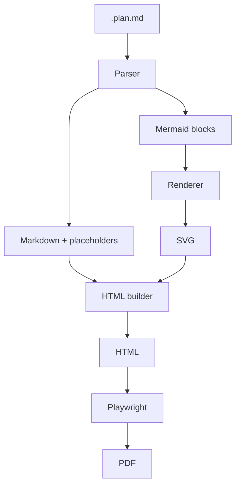
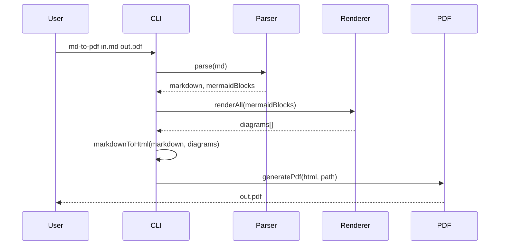

# System Design Plan

## Overview

This plan describes the architecture for the **markdown-to-pdf** pipeline.

## Architecture



## Components

| Component  | Responsibility                    |
|-----------|------------------------------------|
| Parser    | Extract Mermaid, replace with placeholders |
| Renderer  | Mermaid → SVG (or error placeholder)       |
| HTML      | Markdown → HTML, inject diagrams           |
| PDF       | HTML → A4 PDF via Playwright               |

## Sequence



## Code block example

```typescript
export function parseMarkdown(raw: string): ParseResult {
  const mermaidBlocks: MermaidBlock[] = [];
  const markdown = raw.replace(MERMAID_BLOCK_REGEX, (_, source) => {
    // ...
  });
  return { markdown, mermaidBlocks };
}
```

## Next steps

1. Run `npm run build`
2. Run `md-to-pdf sample.plan.md sample.pdf`
3. Open `sample.pdf`
